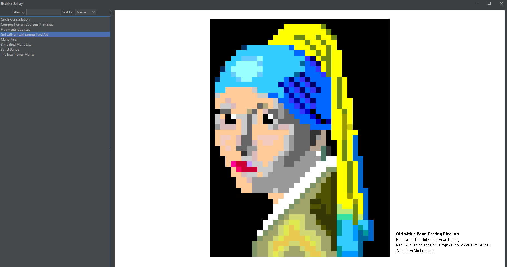

```
┏┓   ┓  •┓     ┏┓  ┓┓      
┣ ┏┓┏┫┏┓┓┃┏┏┓  ┃┓┏┓┃┃┏┓┏┓┓┏
┗┛┛┗┗┻┛ ┗┛┗┗┻  ┗┛┗┻┗┗┗ ┛ ┗┫
                          ┛
```


This project allows dev-artists (like you 👈, surely) to express their 2D creativity in a simple and centralized way.

# 🤝 Contributing

We welcome contributions from dev-artists like you! If you'd like to add your own artwork to the gallery, follow these
steps:

### 1. Create Your Package

Create a new package under `com.endrikagallery.artworks` with your GitHub username. For example, if your GitHub username
is `rado`, create a package named `com.endrikagallery.artworks.rado`.

### 2. Add Your Artwork

Inside your package, create classes that extend `com.endrikagallery.AbstractArtwork`. Implement the `expresses` method
to define how your artwork should be drawn. Here’s a sample class:

```java
package com.endrikagallery.artworks.rado;

import com.endrikagallery.AbstractArtwork;
import com.endrikagallery.model.ArtistInfos;
import com.endrikagallery.model.ArtworkInfos;

import java.awt.*;

public class RadoSampleArtwork extends AbstractArtwork {

    public RadoSampleArtwork(ArtworkInfos artwork, ArtistInfos artist) {
        super(artwork, artist);
    }

    @Override
    public void expresses(Graphics graphics) {
        // Have fun here ^^
        graphics.setColor(Color.BLACK);
        graphics.drawOval(200, 200, 200, 200);
    }
}
```

### 3. Manifest Update
Add a new artwork element to the src/main/resources/artworks.xml file.
Here is a comprehensive example:

```xml
<endrika_gallery>
    <artworks>
        <!-- More artworks here ... -->
        <artwork>
            <name>Spiral Dance</name>
            <description>Une sensation de mouvement fluide et artistique ...</description>
            <artworkClass>com.endrikagallery.artworks.andriantomanga.SpiralArtwork</artworkClass>
            <artist>
                <name>Nabil Andriantomanga</name>
                <countryCode>MG</countryCode>
                <githubId>andriantomanga</githubId>
            </artist>
        </artwork>
    </artworks>
</endrika_gallery>
```
#### Comprehensive list of ```artwork``` elements :

| Element                          | Description                                    | Required |
|----------------------------------|------------------------------------------------|----------|
| `<artwork>`                      | Element representing the artwork               | true     |
| `<name>`                         | The name of the artwork                        | true     |
| `<description>`                  | A brief description of the artwork             | true     |
| `<artworkClass>`                 | The fully qualified class name for the artwork | true     |
| `<artist>`                       | Element containing artist details              | true     |
| `<artist> <name>`                | The name of the artist                         | true     |
| `<artist> <countryCode>`         | The country code of the artist                 | true     |
| `<artist> <githubId>`            | The GitHub ID of the artist                    | true     |
| `<artist> <email>`               | The email address of the artist                | false    |
| `<artist> <phone>`               | The phone number of the artist                 | false    |
| `<artist> <website>`             | The website of the artist                      | false    |


### 4. Submit a Pull Request

After adding your artwork, commit your changes and open a pull request to the main repository. We’ll review and merge
your contribution.

### 5. An important rule:
Everything must be drawn programmatically, so no drawImage, for example.

# 🛠️ License

This project is licensed under the MIT License - see the [LICENSE](LICENSE) file for details. 📝

## 📸 Screenshots
### Example 1 :


### Example 2 :


### Example 3 :


~ end ~